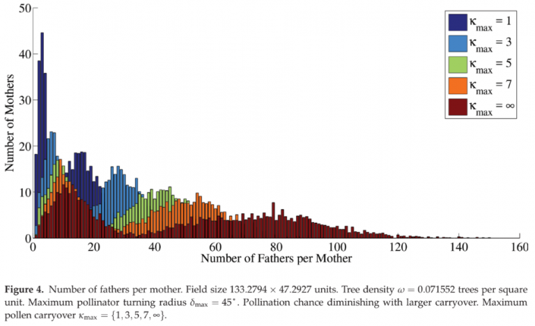

  

## Abstract

From the agent-based, correlated random walk model presented, we observe theeffects of varying the maximum turning angle, δmax, tree density, ω, and pollen carryover, κmax, on the distribution of pollen within a tree population by examining pollination graphs. Varying maximum turning angle and pollen carryover alters the dispersal of pollen, which affects many measures of connectivity of the pollination graph. Among these measures the clustering coefficient of fathers is largest when δmax is between 60 and 90∘ . The greatest effect of varying ω is not on the clustering coefficient of fathers, but on the other measures of genetic diversity. In particular when comparing simulations with randomly placed trees with that of actual tree placement of C. florida at the VCU Rice Center, it is clear that having specific tree locations is crucial in determining the properties of a pollination graph.
