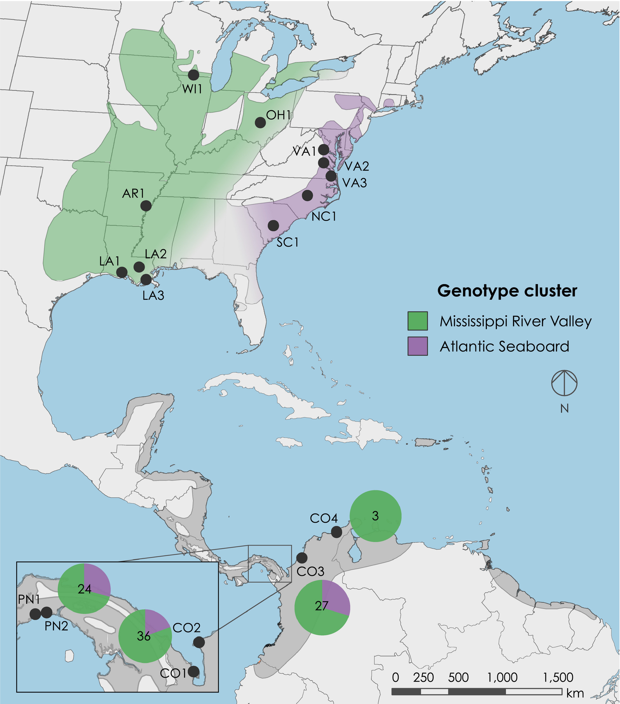

 

## Abstract

Understanding migratory connectivity is essential for determining the drivers behind population dynamics and for implementing effective conservation strategies for migratory species. Genetic markers provide a means to describe migratory connectivity; however, they can be uninformative for species with weak population genetic structure, which has limited their application. Here, we demonstrated a genomic approach to describing migratory connectivity in the prothonotary warbler, Protonotaria citrea, a Neotropical songbird of conservation concern. Using 26,189 single nucleotide polymorphisms (SNPs), we revealed regional genetic structure between the Mississippi River Valley and the Atlantic Seaboard with overall weak genetic differentiation among populations (FST = 0.0055; 95% CI: 0.0051–0.0059). Genetic variation had a stronger association with geographic rather than environmental factors, with each explaining 14.5% and 8.2% of genetic variation, respectively. By varying the numbers of genomic markers used in population assignment models with individuals of known provenance, we identified a maximum assignment accuracy (89.7% to site, 94.3% to region) using a subset of 600 highly differentiated SNPs. We then assigned samples from nonbreeding sites to breeding region and found low migratory connectivity. Our results highlight the importance of filtering markers for informative loci in models of population assignment. Quantifying migratory connectivity for weakly structured species will be useful for expanding studies to a wider range of migratory species across taxonomic groups and may contribute to a deeper understanding of the evolution of migratory strategies.

