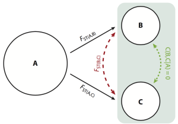

  

## Abstract

At the heart of the analyses of landscape genetics are isolation models seeking to explain either interindividual or interpopulation connectivity. These models use spatial, ecological, and topographic predictor variables measured between sites in an attempt to explain observed genetic variation. During the past decade, these models have adopted an increasingly sophisticated set of techniques to quantify intervening physical and ecological spaces, although they are restrained by rather mundane approaches to characterizing the genetic components of connectivity. Population Graphs are one approach to improving the quantification of genetic covariance used in models of landscape genetics. I explain the construction of the Population Graph framework, explain its strengths and weaknesses, and provide examples of how it has been used during the past decade within the contexts of landscape and population genetics.
