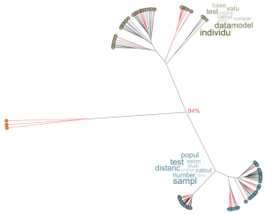

  

## Abstract

For a scientific discipline to be interdisciplinary, it must satisfy two conditions; it must consist of contributions from at least two existing disciplines, and it must be able to provide insights, through this interaction, that neither progenitor discipline could address. In this study, I examine the complete body of peer-reviewed literature self-identified as landscape genetics (LG) using the statistical approaches of text mining and natural language processing. The goal here was to quantify the kinds of questions being addressed in LG studies, the ways in which questions are evaluated mechanistically, and how they are differentiated from the progenitor disciplines of landscape ecology and population genetics. I then circumscribe the main factions within published LG studies examining the extent to which emergent questions are being addressed and highlighting a deep bifurcation between existing individual - and population-based approaches. I close by providing some suggestions on where theoretical and analytical work is needed if LGs is to serve as a real bridge connecting evolution and ecology sensu lato.
