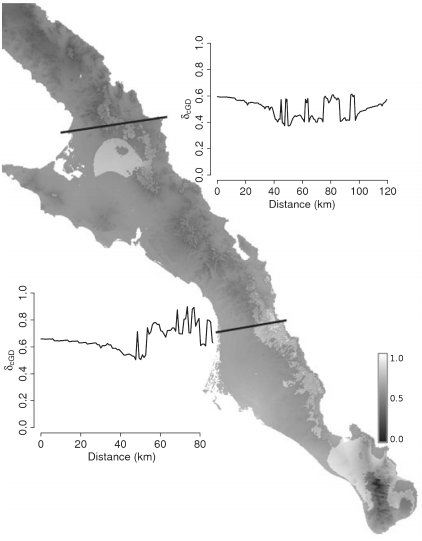

  

## Abstract

Landscape genetics is a burgeoning field of interest that focuses on how site-specific factors influence the distribution of genetic variation and the genetic connectivity of individuals and populations. In this manuscript, we focus on two methodological extensions for landscape genetic analyses: the use of conditional genetic distance (cGD) derived from population networks and the utility of extracting potentially confounding effects caused by correlations between phylogeographic history and contemporary ecological factors. Individual-based simulations show that when describing the spatial distribution of genetic variation, cGD consistently outperforms the traditional genetic distance measure of linearized F(ST) under both 1- and 2-dimensional stepping stone models and Cavalli-Sforza and Edward's chord distance D(c) in 1-dimensional landscapes. To show how to identify and extract the effects of phylogeographic history prior to embarking on landscape genetic analyses, we use nuclear genotypic data from the Sonoran desert succulent Euphorbia lomelii (Euphrobiaceae), for which a detailed phylogeographic history has previously been determined. For E. lomelii, removing the effect of phylogeographic history significantly influences our ability to infer both the identity and the relative importance of spatial and bio-climatic variables in subsequent landscape genetic analyses. We close by discussing the utility of cGD in landscape genetic analyses.
