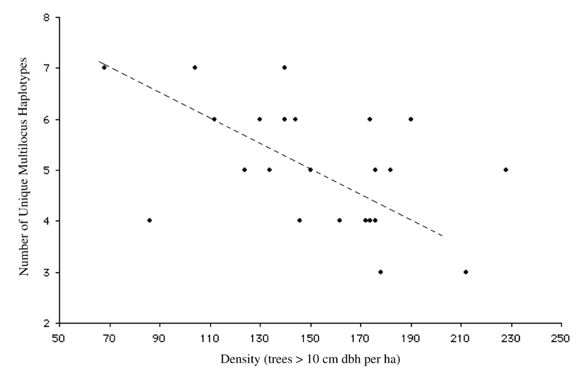

  

## Abstract

Pollen is the dominant vector of gamete exchange for most temperate tree species. Because pollen movement influences the creation, maintenance and erosion of genetic structure in adult populations, it is important to understand what factors influence the process of pollen movement. Isolation by distance in pollen donor populations can create highly structured pollen polls by increased sampling of local fathers. Extrinsic factors, such as the intervening vegetative structure and local pollen donor densities, can also influence the genetic composition of local. pollen pools. Using paternally inherited chloroplast microsatellite markers, we examined the structure and diversity of pollen pools in Pinus echinata Mill. in southern Missouri, USA. Our analysis is based on a multivariate AMOVA analysis of stands (approximate to1 ha; six per region) nested within regions (approximate to 800 ha; four each). Significant multilocus structure of the pollen pool within regions (phi (SR) = 0.095), but not among regions (phi (RT) = 0.010), indicates that pollen movement is relatively restricted. Furthermore, the significant correlation between pairwise genetic and physical distances (Mantel correlation; rho = 0.32) provided support for the isolation by distance hypothesis. Our results indicated that availability of pollen donors did not affect diversity of the pollen pool, measured by the number of unique multilocus genotypes at each stand. However, pollen pool diversity was negatively associated with vegetative structure, measured as total forest tree density. Our findings indicated that on-going pollen movement within continuous forest is relatively restricted as a result of both isolation by distance and vegetative structure.
