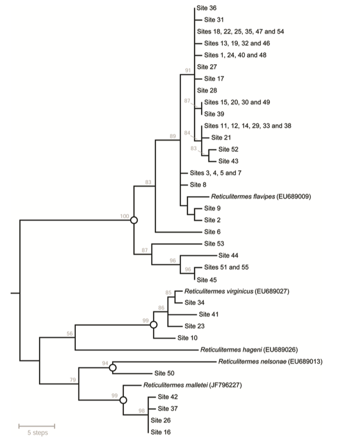

  

## Abstract

Reticulitermes termites play key roles in dead wood decomposition and nutrient cycling in forests. They also damage man-made structures, resulting in considerable economic loss. In the eastern United States, five species (R. flavipes, R. virginicus, R. nelsonae, R. hageni and R. malletei) have overlapping ranges and are difficult to distinguish morphologically. Here we present a molecular tool for species identification. It is based on polymerase chain reaction (PCR) amplification of a section of the mitochondrial cytochrome oxidase subunit II gene, followed by a three-enzyme restriction fragment length polymorphism (RFLP) assay, with banding patterns resolved via agarose gel electrophoresis. The assay was designed using a large set of training data obtained from a public DNA sequence database, then evaluated using an independent test panel of Reticulitermes from the Southern Appalachian Mountains, for which species assignments were determined via phylogenetic comparison to reference sequences. After refining the interpretive framework, the PCR-RFLP assay was shown to provide accurate identification of four co-occurring species (the fifth species, R. hageni, was absent from the test panel, so accuracy cannot yet be extended to training data). The assay is cost- and time-efficient, and will help improve knowledge of Reticulitermes species distributions.
