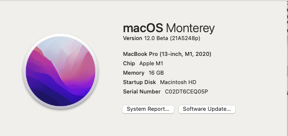

So yesterday, Apple introduced the next set of operating systems for iOS, MacOS, tvOS, iPadOS, and tvOS as well as a bunch of interesting upgrades for all the new hardware.  I took the plunge with installing it on my M1 Macbook and here are some thoughts on items as I see them evolve.

## Overall 

Overall, most things work out of the box with no problems.

- R, RStudio (minus git as described below)
- Mail - I wish they would add "send later" but works great and has more privacy functions.

## Safari

It is still REALLY FAST and new layout for the tabs.

