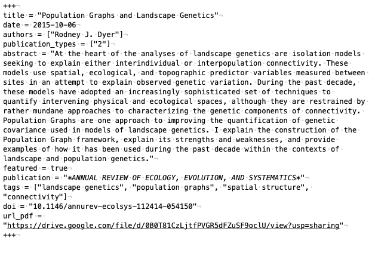
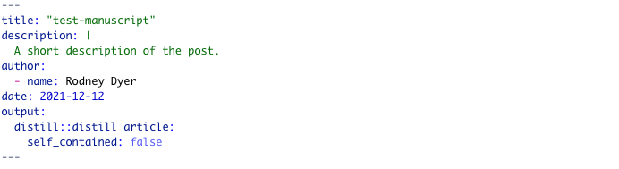
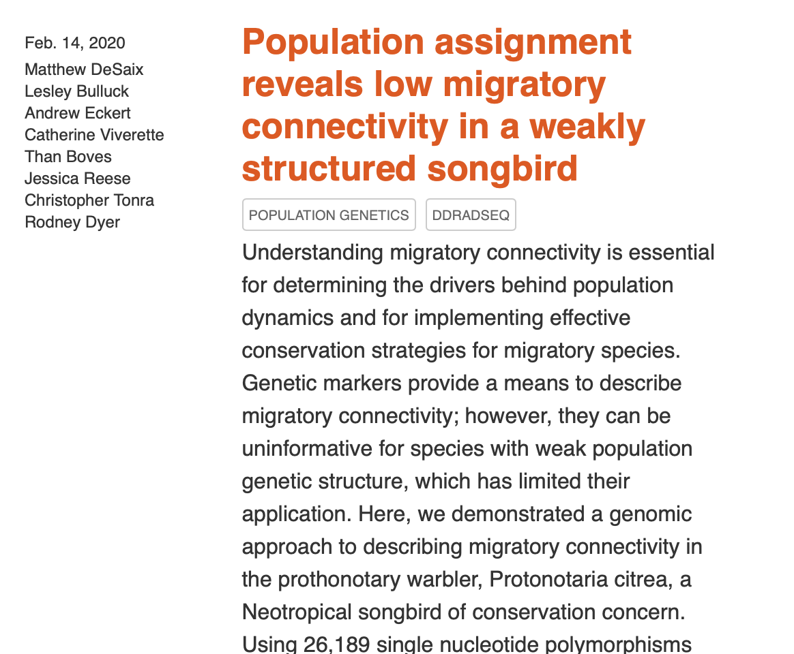

```{r setup, include=FALSE}
library( readr )
```

As part of moving over from [Hugo](https://gohugo.io) to [Distill](https://rstudio.github.io/distill/), I need to move over all my manuscripts.  While putting everything into Markdown is a good idea for portability, there does not seem to be a very quick way to translate YAML.  IN this case, the old YAML looked like this (n.b., they are all .md files, not .Rmd files like distill likes so the syntax hightlighting will not look right):



Which will need to be translated into the new YAML to resemble:



This may not be that big of an deal but at the end of the day, I've got a ton of folders that each represent each manuscript I've published.  I was able to get a lot of it done using some quick perl like this:

```
perl -pi -e s/name =/name:/g file.md
```

However, there is going to be a lot of pain associated with some of it (authors & categories sections).  For that, I'll have to run some `R` code.  Here is how I did it.


```{r}
files <- list.files(path="../../_manuscripts", 
                    recursive = TRUE,
                    full.names = TRUE,
                    pattern = "index.md")
```

So, for each of these files, I need to:  

1. Load markdown file
2. Save as Rmd
3. Use some terminal magic to convert over yaml formatting.

So here it goes:

```{r eval=FALSE}
for( file in files ) { 
  newfile <- gsub(".md", ".Rmd", file,perl = TRUE)
  cmd <- paste("mv",file, newfile )
  system( cmd )
}
```

OK, so that was sufficient for me to get things good enough to compile.  And it looks... meh.


I put all the manuscripts in its own category and subfolder but it has all the abstract shoved into the description.  However, that causes some issues because some of the abstracts are long and it makes for an unreasonable view of the manuscripts. 



and none of the images are showing.  Now we'll have to go through it all and futz around to make it look good.  Here is the whole salchicha.

```{r eval=FALSE}
library( yaml )
files <- list.files(path="../../_manuscripts", 
                    recursive = TRUE,
                    full.names = TRUE,
                    pattern = "index.Rmd")

for( file in files ) { 
  print(file)
  # load in the YAML
  old <- read_yaml( file )
  
  # Make the new file contents
  new <- c("---",
           paste("title:", as.yaml(old$title)),
           paste("date:", as.yaml(old$date ) ) )
  
  # make authors for post
  pub_authors <- unlist( lapply( old$authors, 
                             FUN = function(x) { return(paste("- name:", x))}))
  new <- c(new, 
           "authors:",
           pub_authors)
  
  # put authors, year and publication here.
  year <- strsplit(old$date, "-",fixed = TRUE)[[1]][1]
  pub <- old$publication
  
  description <- paste("description: |")
  description <- paste( "   ", pub, year, " ", sep=". ")

  new <- c(new,
           "description: |",
           description)
  
  # clean up the categories
  if( "categories" %in% names(old) ) { 
    categories <- tolower( gsub( "\"", "", old$categories ) )
    new <- c(new, 
             "categories: ",
             unlist( lapply( categories, 
                             FUN = function(x) { return(paste("-", x))})))
  }
  
  
  
  
  # put in the Journal 
  if( length( old$publication) > 0 ) { 
    new <- c(new,
             paste("journal: ", old$publication))
  }
  
  if( "doi" %in% names( old ) ) { 
    new <- c(new,
             paste("doi: ", old$doi ))
  }
  
  
  # if there is a bib
  bibs <- list.files( dirname(file), 
                      pattern = "*.bib",
                      full.names = TRUE)
  if( length(bibs) == 1 ) { 
    cmd <- paste( "mv", 
                  bibs, 
                  paste( dirname(bibs),
                         "bibliography.bib",
                         sep="/"))
    system(cmd)
    new <- c(new,
             "bibliography: bibliography.bib" )
  }
  
  
  
  #add end stuff
  if( "respository_url" %in% names( old ) ) { 
    new <- c(new, 
             paste("repository_url:",as.yaml(old$respository_url ) ) )
  }
  new <- c( new, 
            paste("output:\n",as.yaml(old$output)),
            "---",
            "")
  new <- gsub("\n\n", "\n", paste( new, collapse="\n") ) 
  
  
    # put in links to PDF and doi if presnt
  links <- ""
  if( "url_pdf" %in% names( old ) ) { 
    url <- old$url_pdf 
    val <- paste( "[](", url, ")", sep="")
    links <- paste( links, val)
  }
  
  if( "doi" %in% names( old ) ) { 
    url <- paste("https://doi.org",old$doi, sep="/")
    val <- paste( "[](",
                  url,
                  ")", sep="") 
    links <- paste( links, val )
  }
  
  new <- c( new, links )
  
  
  
  # Add image if present
  if( "featured" %in% names( old ) ) { 
    img <- paste("")
    new <- c( new, 
              "",
              img )
  }
  
  if( "description" %in% names( old ) ) { 
    new <- c(new,
             "",
             "## Abstract",
             "",
             old$description )
  }

  #  Previously, I saved to a different file so as to not overwrite the important stuff.
  #   Once it worked, then write over the old one.
  # newfile <- paste( dirname(file), "/manuscript.Rmd", sep="")
  write(new, file=file)
  rmarkdown::render(file)
  
}
```

Now, I've just got to go clean up the old temporary files using something like:

```
find _manuscripts -iname manuscrip* -delete
```


```{r}
for( file in list.files(path="../../_manuscripts", 
                    recursive = TRUE,
                    full.names = TRUE,
                    pattern = "index.Rmd") ) { 
  rmarkdown::render( file )
  }
```


