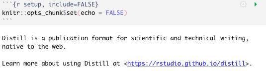

```{r setup, include=FALSE}
knitr::opts_chunk$set( eval=FALSE, echo=TRUE)
```


OK, now that I have moved over most of the  [manuscripts](../2021-12-12-moving-manuscripts-from-hugo/) from the previous site, it comes time to move over some of the older posts.  Many of these posts are important as there is code and data associated with them that I'd like to have access to going forward.

Like before, however, there is some futzing around that needs to be done.  However, this time, I took a different appraoch.  I was less concerned about keeping the category information and all of them were authored by myself, so what I did was:

1. Pick out a set of 100 or so entries to keep.  
2. Move them into a top-level folder called `old_posts`.  
3. Read them in, one at a time, and extracted the title and date.
4. Created a new post using `distill::create_post()` using that date and title.  
5. Pasted the contents of the markdown (skipping all the YAML crazyness) on the end of the new post (n.b., did you know that you could use `cat()` to concatenate onto the end of a file on the filesystem?  I didn't!).  

So here is the basic code I used for it.


```{r eval=FALSE}
rm(list = ls())
library( distill )
library( stringr )

files <- list.files(
  path = "old_posts",
  pattern = "index.Rmd",
  recursive = TRUE,
  full.names = TRUE
)

for (file in files) {
  print(file)
  lines <- readLines(file)
  
  # find the date 
  idx <- grep( "date: ", lines, fixed = TRUE)
  date <- ""
  
  if (length(idx) == 1) {
    date <- str_sub( lines[idx], 7, 16)
  }
  
  # Find the second --- and put in the output type
  idx <- grep("---", lines, fixed = TRUE)
  content <- ""
  lines <- c(lines, " ", " ", " ")
  if (length(idx) == 2) {
    content <- paste( lines[ (idx[2]+1):length(lines) ] , 
                      collapse = "\n")
  }
  
  # find the title
  idx <- grep("title: ", lines, fixed=TRUE )
  title <- "No Title"
  if( length(idx)>0 ) { 
    title <- str_trim( gsub('[[:punct:] ]+', 
                            " ", 
                            str_remove(lines[idx], "title: ")))
  }
  
  ofile <- str_replace_all( tolower(title),  
                            pattern=" ", 
                            replacement = "-" ) 
  nfile <- paste(date, ofile, sep="-") 
  path <- paste("_posts/",
                nfile,
                "/", 
                ofile, 
                ".Rmd", sep="")

  if( !file.exists(path) ) { 

    distill::create_post( title[1], 
                          collection="posts", 
                          date = date, 
                          date_prefix=date, 
                          edit = FALSE)
    cat( content, 
         file = path, 
         append=TRUE, 
         sep="\n")  
  }
}
```

But the problem is that when we use `distill::createpost()`, it puts in the following default content into the markdown.  And then I just appended the original content onto the end of it.



So I did a quick global search and replace using my favorite [TextMate](https://macromates.com) and then ran the following code to render it all out and looking good.

```{r eval=FALSE}
for( file in list.files(path="_posts/", 
                        pattern = "*.Rmd",
                        recursive = TRUE,
                        full.names = TRUE) ) { 
  
  rmarkdown::render( file )  
}
```


### Questions?


