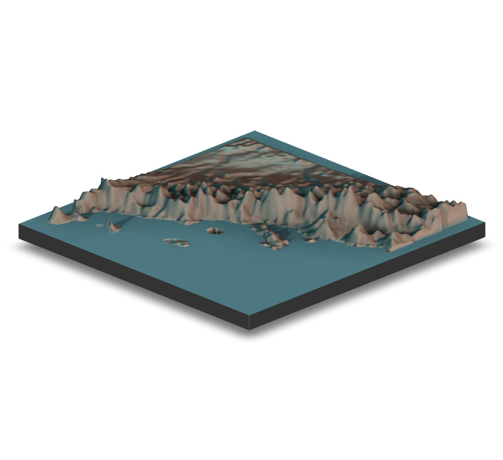

```{r setup, include=FALSE}
knitr::opts_chunk$set( echo = TRUE,
                       message = FALSE,
                       error = FALSE)
library( tidyverse )
```


This is going to require the `rayshader` library to get some orthorgraphic imagery of topologies.  This will be a quick 


## Install Packages If Necessary

```{r eval=FALSE}
for( lib in c("rayshader","magick") ) { 
  if( !require(lib) ) { 
    install.packages(lib)
  }
}

if( !require(webshot2 ) ) { 
  remotes::install_github("rstudio/webshot2")
}
```


## The Data

For this example, I'm going to use a section of Baja California, in the vacinity of the town of Loreto, BCS.

```{r, layout="l-screen-inset", echo=FALSE}
knitr::include_graphics("https://live.staticflickr.com/65535/51747403237_94a3f1f029_o_d.jpg")
```

We can load it in using the direct url and crop it to the approximate size of the area of interest.


```{r}
library( rayshader )
library( raster )
```

I have a raster up on github for my [teaching](https://dyerlab.github.io/ENVS-Lectures) site that we'll use.


```{r cache=TRUE}
url <- "https://github.com/dyerlab/ENVS-Lectures/raw/master/data/alt_22.tif"
raster( url ) %>%
  crop(extent( -112, -110.5, 25, 26.5) ) -> baja_california
plot( baja_california ) 
```

Now, we should probably reproject the raster.  Right now, the datum for it is defined as:

```{r}
crs( baja_california )
```

Which is great.  However, the x- and y- coordinates in this are defined by degrees, whereas the values in it, the z-axis for us below, is defined in the unit of meters.  

Let's reproject this raster (see [lecture here](https://dyerlab.github.io/ENVS-Lectures/spatial/rasters/slides.html#1) if you want to know more about rasters) to a datum whose units are also in meters.  I grabbed the proj.4 definition of [epsg = 6366](https://epsg.io/6366), which covers Mexico west of -114 degrees in zone 11N.

```{r}
baja_utm <- raster::projectRaster(baja_california, crs="+proj=utm +zone=11 +ellps=GRS80 +towgs84=0,0,0,0,0,0,0 +units=m +no_defs ")
baja_utm 
```

Before I move on, I'm going to smooth out the jaggedness of this a bit [exmaple here](../2021-12-15-smoothing-rasters/smoothing-rasters.html).  

```{r}
smooth_utm <- focal( baja_utm, 
                       w = matrix(1, 3, 3), 
                       fun = mean, 
                       na.rm=TRUE)
par( mfrow =c(1,2) ) 
plot( baja_utm, legend=FALSE )
plot( smooth_utm, legend=FALSE ) 
par( mfrow=c(1,1) )
```

Just taking the 'edge' off, so to speak.  For some reason, one of the islands is denoted as negative elevation, so I'll fix that 

```{r}
baja_matrix <- abs( raster_to_matrix( smooth_utm ) )
```

And then clean it up.  This elevation raster was originally provided by [WorldClim](https://worldclim.org), which ignores elevations in the water.  So there is a *ton* of `NA` values for where the Pacific Ocean and Sea of Cortéz is located.  I'm going to replace all the `NA` with `0`

```{r}
sum( is.na( baja_matrix )  )
baja_matrix[ is.na(baja_matrix)] <- 0
```


## Plotting with Shading

The matrix can now be plot with shading.  There are several built-in palettes (and you can supply your own as well).

```{r message=FALSE}
baja_matrix %>%
  sphere_shade( texture="bw" ) %>%
  plot_map() 
```
The possible values include:


*texture*
> Default 'imhof1'. Either a square matrix indicating the spherical texture mapping, or a string indicating one of the built-in palettes ('imhof1','imhof2','imhof3','imhof4','desert', 'bw', and 'unicorn').

Which look like this

```{r}
baja_matrix %>%
  sphere_shade( texture = "desert" )  %>% 
  plot_map() 
```

and this

```{r}
baja_matrix %>%
  sphere_shade( texture = "imhof2",
                sunangle = 45 ) %>%
  plot_map() 
```

and this.

```{r}
baja_matrix %>%
  sphere_shade( texture = "imhof3",
                sunangle = 45 ) %>%
  plot_map() 
```

and this

```{r}
baja_matrix %>%
  sphere_shade( texture = "imhof4",
                sunangle = 45 ) %>%
  plot_map() 
```

and of course, there is a unicorn 

```{r}
baja_matrix %>%
  sphere_shade( texture = "unicorn",
                sunangle = 45 ) %>%
  plot_map() 
```


## Adding Water

Water can be represented as either opaque or transparent.  These rasters *do not* have bathymetry data (and I set them all to zero), so I'll this part and just make it a solid color.

```{r}
baja_matrix %>%
  sphere_shade( texture = "desert",
                sunangle = 45 ) %>%
  add_water( detect_water( baja_matrix ), color = "desert") %>% 
  plot_map() 

```


## Adding Shadows

There are several different kinds of shadings we can add to a scene.  Here I'll shading from the sun (and setting the angle and altitude).

```{r}
baja_matrix %>%
  sphere_shade( texture = "desert",
                sunangle = 45 ) %>%
  add_water( detect_water( baja_matrix ), color = "desert") %>% 
  add_shadow( ray_shade( baja_matrix, 
                         sunangle=82,
                         sunaltitude = 85), 0.5) %>%
  plot_map() 
```

We can also add onto that ambient shading.

```{r}
baja_matrix %>%
  sphere_shade( texture = "desert",
                sunangle = 45 ) %>%
  add_water( detect_water( baja_matrix ), color = "desert") %>% 
  add_shadow( ray_shade( baja_matrix, 
                         sunangle=82,
                         sunaltitude = 85), 0.5) %>%
  add_shadow( ambient_shade( baja_matrix), 0 ) %>%
  plot_map() 
```


## Rendering in 3-Space

Now let's make it a bit more interactive.  Unfortunately, you will not be able to see the popup window and use your mouse to move it around as this is being cast onto a static webpage (so run the code yourself). 

The following steps will require that you can plot `rgl` content.  Depending upon your platform, you may need to download a few things.  For example, on OSX, you need to download XQuartz (google it).  I have no idea what you'll need on Windows or Linux.

This will plot it and then render it appropriately in an external window.

```{r}
baja_matrix %>%
  sphere_shade( texture = "desert",
                sunangle = 45 ) %>%
  add_water( detect_water( baja_matrix ), color = "desert") %>% 
  add_shadow( ray_shade( baja_matrix, 
                         sunangle=82,
                         sunaltitude = 85), 0.5) %>%
  add_shadow( ambient_shade( baja_matrix), 0 ) %>%
  plot_3d( baja_matrix/5, 
           zscale=10,
           fov=0,
           theta = 135,
           zoom = 1, 
           phi = 45, 
           windowsize = c(1000,800))
Sys.sleep(0.2)
render_snapshot()
```
The parameters of `plot_3d` include: 
- *zscale:* scaling in the z-axis. 
- *fov:* Field of View.
- *theta:* Rotation of the landscape.
- *zoom:*  Zoom  
- *phi:* Angle at which camera is looking at the landscape

You'll just have to play around with these to get them to look proper for the landscape you are using.


```{r}
baja_matrix %>%
  sphere_shade( texture = "desert",
                sunangle = 45 ) %>%
  add_water( detect_water( baja_matrix ), color = "desert") %>% 
  add_shadow( ray_shade( baja_matrix, 
                         sunangle=82,
                         sunaltitude = 85), 0.5) %>%
  add_shadow( ambient_shade( baja_matrix), 0 ) %>%
  plot_3d( baja_matrix/5, 
           zscale=10,
           fov=0,
           theta = 150,
           zoom = 0.75, 
           phi = 30, 
           windowsize = c(1000,800))
Sys.sleep(0.2)
render_snapshot()
```
We can even use multi-pass rendering to make the image a bit better in quality.

```{r eval=FALSE}
baja_matrix %>%
  sphere_shade( texture = "desert",
                sunangle = 45 ) %>%
  add_water( detect_water( baja_matrix ), color = "desert") %>% 
  add_shadow( ray_shade( baja_matrix, 
                         sunangle=82,
                         sunaltitude = 85), 0.5) %>%
  add_shadow( ambient_shade( baja_matrix), 0 ) %>%
  plot_3d( baja_matrix/5, 
           zscale=10,
           fov=0,
           theta = 150,
           zoom = 0.75, 
           phi = 30, 
           windowsize = c(1000,800))
Sys.sleep(0.2)
render_highquality(samples=200, scale_text_size = 24, clear=TRUE)
```


That looks pretty good for a cheap and quick 3d render.