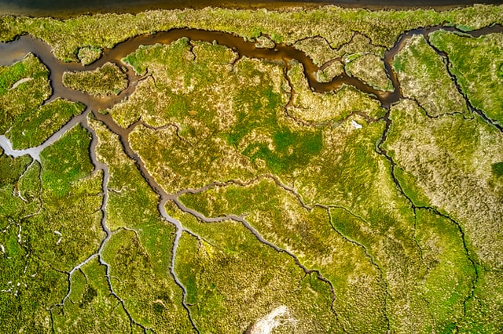

```{r setup, include=FALSE}
knitr::opts_chunk$set(echo = FALSE)
```


## Workshop Logistics


&nbsp; | &nbsp;
---------|------------------------  
*When:*  | March 7-8, 2022  
*Where:* | 1111 East Main Street, Richmond Virginia [37.5367, -77.4350](https://www.google.com/maps/place/1111+E+Main+St,+Richmond,+VA+23219/@37.5365814,-77.4372005,17z/data=!3m1!4b1!4m5!3m4!1s0x89b111183eed8707:0x24b3c78b6da63e39!8m2!3d37.5365772!4d-77.4350118)  
*Impetus:*|   Build internal capacity at for using R as an analysis platform to increase efficiency of data management.  
*Instructor:* | [](https://dyerlab.org/dyerprofile/dyerprofile)  
*Data Sets*: | 


### Introduction to R and RStudio

[](https://dyerlab.github.io/ENVS-Lectures/deq/1_r_environment/slides.html#1)    

Learning Objectives:  
  - Learning about the R environment,  
  - Understand differences between coding to the Console versus making scripts,   
  - Use a Project to organize code, data, analyses, & narratives,  
  - Personalize the RStudio GUI for success.  

---

### Character Data and Basic Function Usage
[](https://dyerlab.github.io/ENVS-Lectures/deq/2_functions_strings/slides.html#1)

Learning Objectives:  
  - Learn about basic function structure,  
  - Explore the built-in help system,  
  - Practice operations using the fundamental data type `character`,  
  - Manipulate data in `vector` formats,  
  - Perform textual analyses using the `stringr` library.  

[stringr Cheatsheet](https://evoldyn.gitlab.io/evomics-2018/ref-sheets/R_strings.pdf) 


---

### Numeric Data and Data Frames

[](https://dyerlab.github.io/ENVS-Lectures/deq/3_numeric_dataframes/slides.html#1)

Learning Objectives:  
  - Explore numeric data and mathematical operations.  
  - Create and manipulate data within `data.frame` objects.  
 

---

### Basic Data Manipulation - Tidyverse
[](https://dyerlab.github.io/ENVS-Lectures/deq/4_data_manipulations/slides.html#1)

Learning Objectives:  
  - Understand data manipulation verbs,     
  - Pipe data through several modifier functions to derive inferences,  
  - Filter and select subsets of a larger data set,  
  - Group and summarize measurements to derive summary parameters

[Data Wrangling Cheatsheet](https://www.rstudio.com/wp-content/uploads/2015/02/data-wrangling-cheatsheet.pdf)

  

---
  
  
### Non-Character Character Data
[](https://dyerlab.github.io/ENVS-Lectures/deq/5_dates_factors/slides.html#1)

Learning Objectives:    
  - Apply the `mutate` operator to create derived data columns.    
  - Demonstrate the use of unordered and ordered factor data.  
  - Convert textual representations of dates and times into date objects.  
  - Derive temporal inferences from date objects  

[forcats Cheatsheet](http://www.flutterbys.com.au/stats/downloads/slides/figure/factors.pdf)  

[lubridate Cheatsheet](https://raw.githubusercontent.com/rstudio/cheatsheets/main/lubridate.pdf)


---


### Visualizing Data - Basic & GGPlot
[](https://dyerlab.github.io/ENVS-Lectures/deq/6_visualizations/slides.html#1)

Learning Objectives:  
  - Learn about joins to merge data from two or more data.frames.
  - Develop your first function for consistent data formatting prior to visualization.    
  - Understand and implement basic plotting routines provided in `R::graphics`  
  - Convert raw data into high-quality graphical output using a variety of  `ggplot2` routines.  
  
[Cheatsheet](https://raw.githubusercontent.com/rstudio/cheatsheets/main/data-visualization.pdf)

---


### Interactive Mapping 
[](https://dyerlab.github.io/ENVS-Lectures/deq/7_mapping/slides.html#1)

Learning Objectives:  
  - Understand how to create a viable map display.  
  - Apply differential tile providers to an interactive map.  
  - Create markers on a map representing data found within the data frame.  

[leaflet Cheatsheet](https://ugoproto.github.io/ugo_r_doc/pdf/leaflet-cheat-sheet.pdf)

---

### Markdown 
[](https://dyerlab.github.io/ENVS-Lectures/deq/9_markdown/slides.html#1)

Learning Objectives:   
  - Understand basic markup to represent common textual components.  
  - Insert graphical output (figures, maps, etc) into a markdown document.  
  - Inject components of statistical inferences into the text of a markdown document.  
  
[markdown Cheatsheet](https://raw.githubusercontent.com/rstudio/cheatsheets/main/rmarkdown.pdf)

