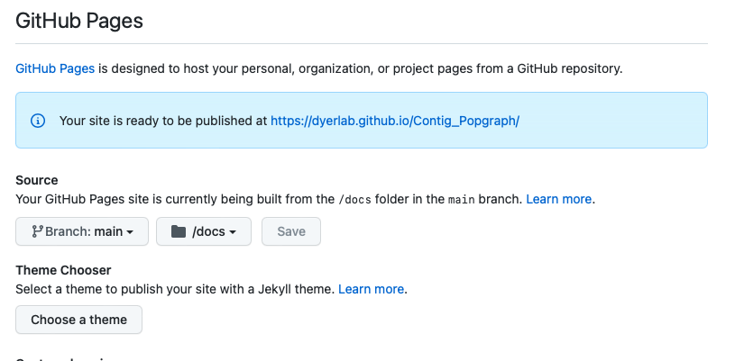
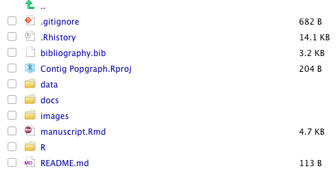

o, I’ve been having some fun playing around with the [Distill for R Markdown](https://rstudio.github.io/distill/) package as I work on getting back into research after the “Admin Craptastic” I’ve been doing through.  It is a really nice way to create manuscripts and publish content with the help of [github](https://github.com) and [GitHub Pages](https://pages.github.com) .  

One of the things that has been holding me back thought is that I would have to set up a custom script so that the manuscript file itself (when compiled into html) could be moved into a specific folder in the repository that will be served up on GitHub pages.  I chose to use the `/docs` folder and set this up in the settings section of the repository.  Once you save it, it looks like this.



Then, go back to your repository and add the folder and check it into your GitHub repository.



The main problems were:

1. The manuscript is typically named `manuscript.Rmd` (or something that is typically not `index`, which means that it will have to be renamed upon check-in to the repository. In previous incarnations, I put in a hook into git that would copy it over just prior to committing but this was a pain as it was hidden behind the scenes.
2. The file was not in the `docs` folder so no matter what I named it, it would have to be moved anyways.

## The Fix

So the fix is to override the knit function directly in the Rmd YAML data.  There is an optional argument that you can use to have a custom render function that is called when you hit the “knit” button in [RStudio](https://rstudio.com), that has the following syntax.

```
knit: (function(inputFile, encoding) { 
  rmarkdown::render(inputFile,
                    encoding=encoding,
                    output_file='docs/index.html') })
```

Now, if you put that stuff into the YAML, it will auto-magically render it with the correct name and location by itself behind the scenes AND you will still see it in the preview stuff.

Very cool.
