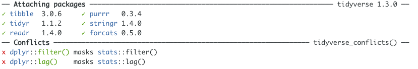

One of the few annoying things I find with `dplyr` lately is the addition of an experimental option where if you use something like, 

```r
group_by(X) %>% 
  summarize( Val = mean(Y))
``` 

it gives you an error message with something like.

> `summarise()` has grouped output by 'X'. You can override using the `.groups` argument.

But why would I want to 'override' that grouping dplyr::authors?  Didn't I **just set the grouping**?  I would suspect that the majority of use cases are exactly like above (`group_by()` immediately by `summarize()`).  

While much of `tidyverse` is too verbose for most of my liking.  I can do without messages like:



Well I finally figured out how to shut the first part up (still working on the second part). 
Just put the following code into your `.Rprofile` file for a global fix, or any code you are using on a per-file basis.

```
options( dplyr.summarise.inform = FALSE )
```

Now if we could just find some way to not have to use `include=FALSE` in the chunk preamble or `suppressPackageStartupMessages(library(dplyr))` just to load in a library without adding a bunch of crap to our markdown files.


