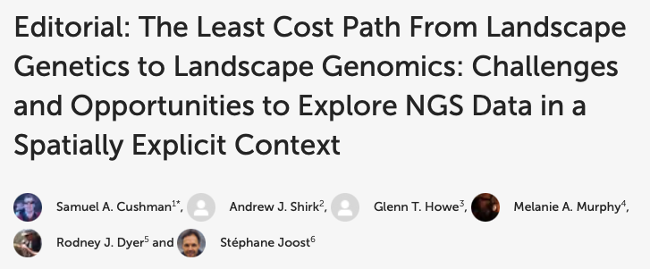

  

## Abstract

Ecosystems are the stage on which the play of evolution is acted. Inferring evolutionary processes from the spatial and temporal genetic patterns they produce in populations is challenging because ecosystems are highly complex, spatially structured, and temporally varying. The field of landscape genetics has offered a means of navigating these challenges to make eco-evolutionary insights for many species. The emerging field of landscape genomics offers great promise to expand the potential of landscape genetic analysis even further. The purpose of this Research Topic for Evolutionary and Population Genetics is to explore a number of critical challenges and opportunities for the transition from landscape genetics to landscape genomics.

