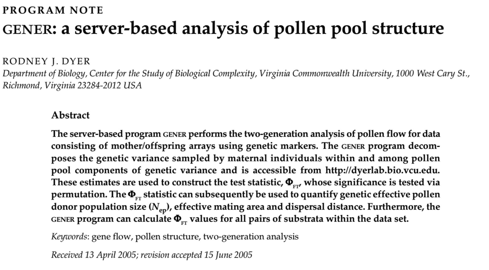

  

## Abstract

The server-based program GENER performs the two-generation analysis of pollen flow for data consisting of mother/offspring arrays using genetic markers. The GENER program decomposes the genetic variance sampled by maternal individuals within and among pollen pool components of genetic variance and is accessible from http://dyerlab.bio.vcu.edu. These estimates are used to construct the test statistic, Phi(FT), whose significance is tested via permutation. The Phi(FT) statistic can subsequently be used to quantify genetic effective pollen donor population size (N-ep), effective mating area and dispersal distance. Furthermore, the GENER program can calculate Phi(FT) values for all pairs of substrata within the data set.
