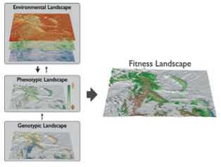

  

## Abstract

Whether they are used to describe fitness, genome architecture or the spatial distribution of environmental variables, the concept of a landscape has figured prominently in our collective reasoning. The tradition of landscapes in evolutionary biology is one of fitness mapped onto axes defined by phenotypes or molecular sequence states. The characteristics of these landscapes depend on natural selection, which is structured across both genomic and environmental landscapes, and thus, the bridge among differing uses of the landscape concept (i.e. metaphorically or literally) is that of an adaptive phenotype and its distribution across geographical landscapes in relation to selective pressures. One of the ultimate goals of evolutionary biology should thus be to construct fitness landscapes in geographical space. Natural plant populations are ideal systems with which to explore the feasibility of attaining this goal, because much is known about the quantitative genetic architecture of complex traits for many different plant species. What is less known are the molecular components of this architecture. In this issue of Molecular Ecology, Parchman (2012) pioneer one of the first truly genome-wide association studies in a tree that moves us closer to this form of mechanistic understanding for an adaptive phenotype in natural populations of lodgepole pine (Pinus contorta Dougl. ex Loud.).
