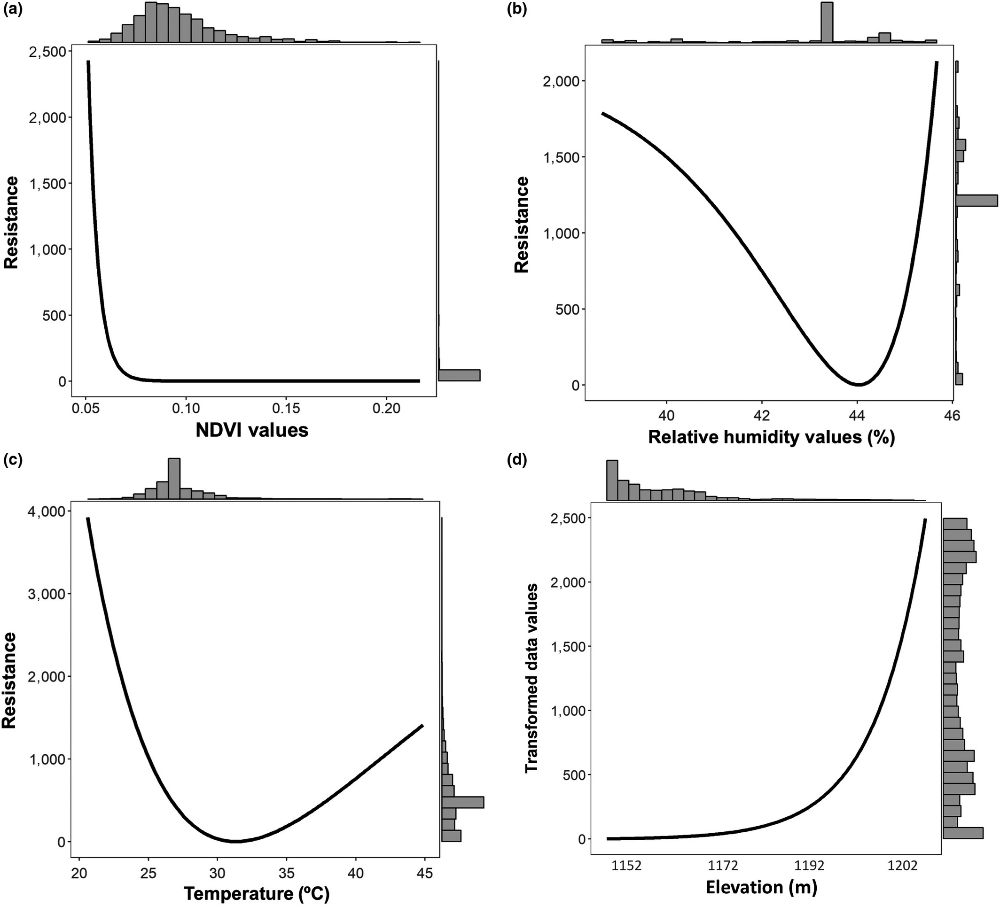
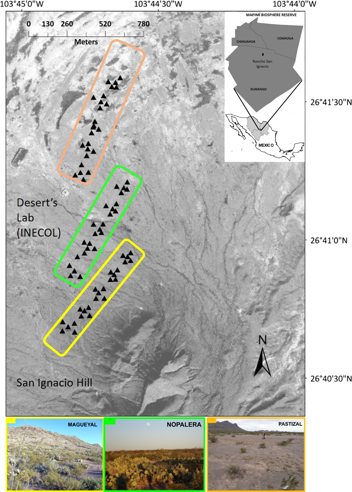

  

## Abstract

Gene flow in animals is limited or facilitated by different features within the landscape matrix they inhabit. The landscape representation in landscape genetics (LG) is traditionally modeled as resistance surfaces (RS), where novel optimization approaches are needed for assigning resistance values that adequately avoid subjectivity. Also, desert ecosystems and mammals are scarcely represented in LG studies. We addressed these issues by evaluating, at a microgeographic scale, the effect of landscape features on functional connectivity of the desert-dwelling Dipodomys merriami. We characterized genetic diversity and structure with microsatellites loci, estimated home ranges and movement of individuals using telemetry-one of the first with rodents, generated a set of individual and composite environmental surfaces based on hypotheses of variables influencing movement, and assessed how these variables relate to individual-based gene flow. Genetic diversity and structure results evidenced a family-induced pattern driven by first-order-related individuals, notably determining landscape genetic inferences. The vegetation cover and soil resistance optimized surface (NDVI) were the best-supported model and a significant predictor of individual genetic distance, followed by humidity and NDVI+humidity. Based on an accurate definition of thematic resolution, we also showed that vegetation is better represented as continuously (vs. categorically) distributed. Hence, with a nonsubjective optimization framework for RS and telemetry, we were able to describe that vegetation cover, soil texture, and climatic variables influence D. merriami's functional connectivity at a microgeographic scale, patterns we could further explain based on the home range, habitat use, and activity observed between sexes. We describe the relationship between environmental features and some aspects of D. merriami's behavior and physiology.
