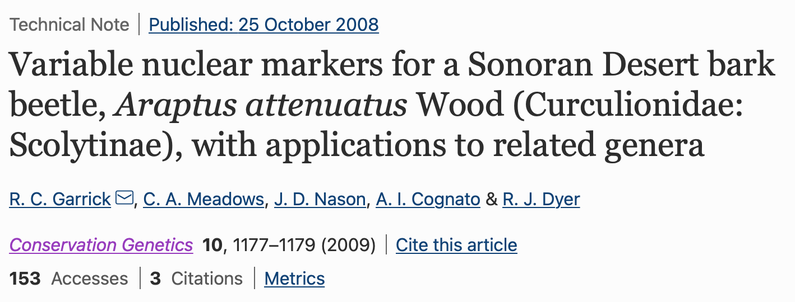

 

## Abstract

We report eight new co-dominant nuclear markers for population genetics of the bark beetle Araptus attenuatus Wood. Several loci include introns from low-copy genes, and four cross-amplify in one or more related genera. The markers show moderate levels of polymorphism (2-19 alleles per locus), and no loci showed significant deviations from Hardy-Weinberg or linkage equilibrium across both of the two populations examined, consistent with Mendelian inheritance patterns.
