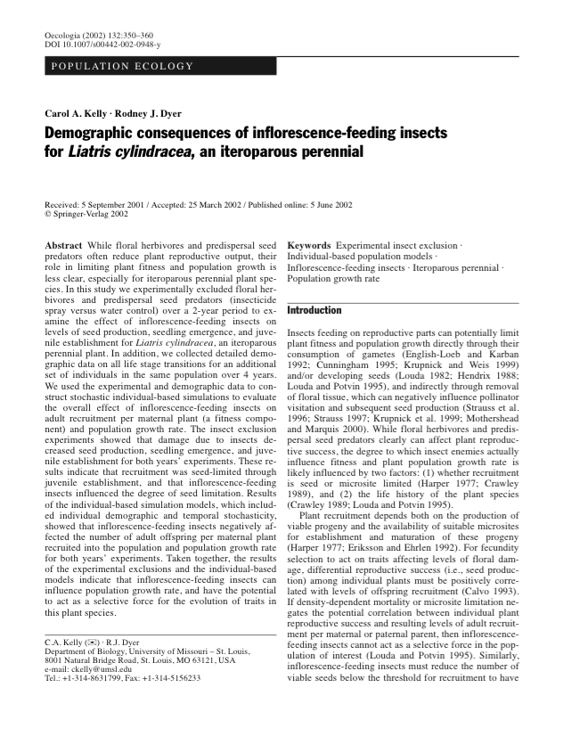

  

## Abstract

While floral herbivores and predispersal seed predators often reduce plant reproductive output, their role in limiting plant fitness and population growth is less clear, especially for iteroparous perennial plant species. In this study we experimentally excluded floral herbivores and predispersal seed predators (insecticide spray versus water control) over a 2-year period to examine the effect of inflorescence-feeding insects on levels of seed production, seedling emergence, and juvenile establishment for Liatris cylindracea, an iteroparous perennial plant. In addition, we collected detailed demographic data on all life stage transitions for an additional set of individuals in the same population over 4 years. We used the experimental and demographic data to construct stochastic individual-based simulations to evaluate the overall effect of inflorescence-feeding insects on adult recruitment per maternal plant (a fitness component) and population growth rate. The insect exclusion experiments showed that damage due to insects decreased seed production, seedling emergence, and juvenile establishment for both years' experiments. These results indicate that recruitment was seed-limited through juvenile establishment, and that inflorescence-feeding insects influenced the degree of seed limitation. Results of the individual-based simulation models, which included individual demographic and temporal stochasticity, showed that inflorescence-feeding insects negatively affected the number of adult offspring per maternal plant recruited into the population and population growth rate for both years' experiments. Taken together, the results of the experimental exclusions and the individual-based models indicate that inflorescence-feeding insects can influence population growth rate, and have the potential to act as a selective force for the evolution of traits in this plant species.
