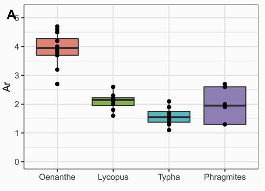

In plants, long-distance dispersal is both attenuated and directed by specific movement vectors, including animals, wind, and/or water. Hence, movement vectors partly shape metapopulation genetic patterns that are, however, also influenced by other life-history traits such as clonal growth. We studied the relationship between area, isolation, plant-species richness, reproduction, and dispersal mechanisms with genetic diversity and divergence in 4 widespread wetland plant-species in a total of 20 island-like kettle-hole habitats surrounded by an intensive agricultural landscape. Our results showed that genetic parameters reflect the reproduction strategies with the highest genetic diversity being observed in the non-clonal, outcrossing *Oenanthe aquatica* compared to the clonal *Lycopus europaeus*, *Typha latifolia*, and *Phragmites australis*. Lycopus showed a positive relationship between genetic diversity and kettle-hole area, but a negative relationship with the number of neighboring kettle holes (less isolation). Genetic diversity increased with plant-species richness in the clonal species Phragmites and Lycopus; while it decreased in the non-clonal Oenanthe. Finally, genetic divergence and, therefore, connectivity differed between alternative dispersal strategies, where wind-dispersed Typha and Phragmites had a higher gene flow between the analyzed kettle holes compared with the insect-pollinated, hydrochorous Lycopus and Oenanthe. Our study provides information on genetic patterns related to reproduction and dispersal mechanisms of 4 common wetland species contributing to the understanding of the functioning of plant metacommunities occurring in kettle holes embedded in agricultural landscapes.