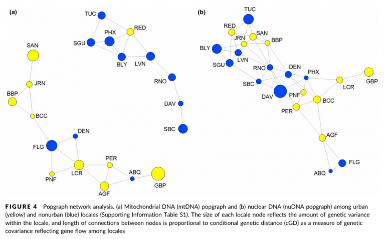

  

## Abstract

Urban fragmentation can reduce gene flow that isolates populations, reduces genetic diversity and increases population differentiation, all of which have negative conservation implications. Alternatively, gene flow may actually be increased among urban areas consistent with an urban facilitation model. In fact, urban adapter pests are able to thrive in the urban environment and may be experiencing human-mediated transport. Here, we used social network theory with a population genetic approach to investigate the impact of urbanization on genetic connectivity in the Western black widow spider, as an urban pest model of human health concern. We collected genomewide single nucleotide polymorphism variation from mitochondrial and nuclear double-digest RAD (ddRAD) sequence data sets from 210 individuals sampled from 11 urban and 10 nonurban locales across its distribution of the Western United States. From urban and nonurban contrasts of population, phylogenetic, and network analyses, urban locales have higher within-population genetic diversity, lower between-population genetic differentiation and higher estimates of genetic connectivity. Social network analyses show that urban locales not only have more connections, but can act as hubs that drive connectivity among nonurban locales, which show signatures of historical isolation. These results are consistent with an urban facilitation model of gene flow and demonstrate the importance of sampling multiple cities and markers to identify the role that urbanization has had on larger spatial scales. As the urban landscape continues to grow, this approach will help determine what factors influence the spread and adaptation of pests, like the venomous black widow spider, in building policies for human and biodiversity health.
