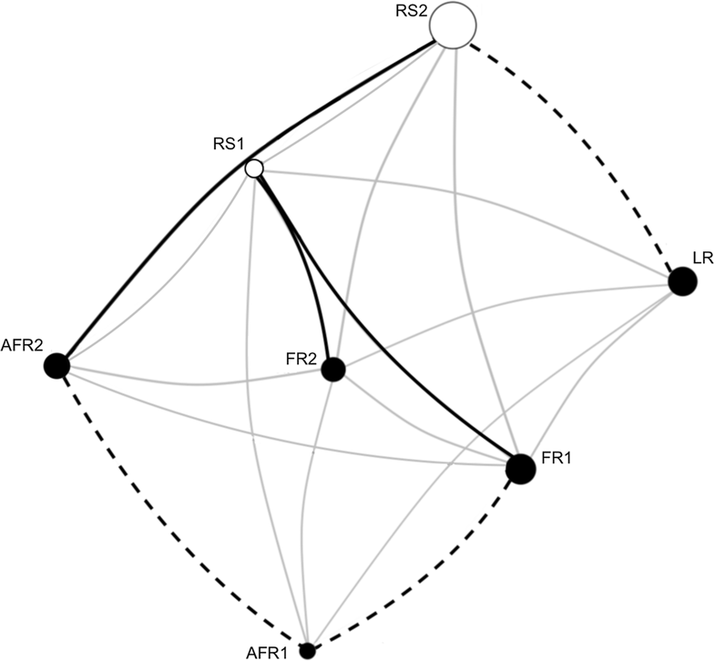

  

## Abstract

Habitat fragmentation affects landscape connectivity, the extent of which is influenced by the movement capacity of the vectors of seed and pollen dispersal for plants. Negative impacts of reduced connectivity can include reduced fecundity, increased inbreeding, genetic erosion and decreased long-term viability. These are issues for not only old (remnant) populations, but also new (restored) populations. We assessed reproductive and connective functionality within and among remnant and restored populations of a common tree, Banksia menziesii R.Br. (Proteaceae), in a fragmented urban landscape, utilising a genetic and graph theoretical approach. Adult trees and seed cohorts from five remnants and two restored populations were genotyped using microsatellite markers. Genetic variation and pollen dispersal were assessed using direct (paternity assignment) and indirect (pollination graphs and mating system characterisation) methods. Restored populations had greater allelic diversity (Ar=8.08; 8.34) than remnant populations (Ar range=6.49-7.41). Genetic differentiation was greater between restored and adjacent remnants (F-ST=0.03 and 0.10) than all other pairwise comparisons of remnant populations (mean FST=0.01 +/- 0.01; N=16 P=0.001). All populations displayed low correlated paternity (rp=0.06-0.16) with wide-ranging realised pollen dispersal distances (<1.7km) and well-connected pollen networks. Here, we demonstrate reproductive and connective functionality of old and new populations of B. menziesii within a fragmented landscape. Due to long-distance pollination events, the physical size of these sites underestimates their effective population size. Thus, they are functionally equivalent to large populations, integrated into a larger landscape matrix.
