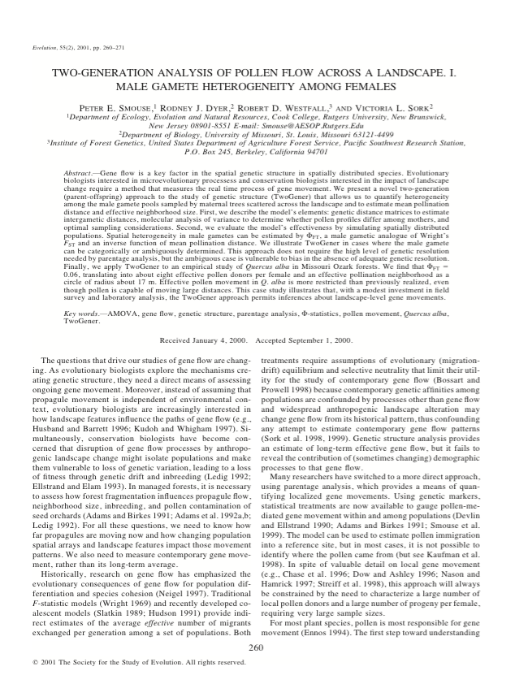

 

## Abstract

Gene flow is a key factor in the spatial genetic structure in spatially distributed species. Evolutionary biologists interested in microevolutionary processes and conservation biologists interested in the impact of landscape change require a method that measures the real time process of gene movement. We present a novel two-generation (parent-offspring) approach to the study of genetic structure (TwoGener) that allows us to quantify heterogeneity among the male gamete pools sampled by maternal trees scattered across the landscape and to estimate mean pollination distance and effective neighborhood size. First, we describe the model's elements: genetic distance matrices to estimate intergametic distances, molecular analysis of variance to determine whether pollen profiles differ among mothers, and optimal sampling considerations. Second, we evaluate the model's effectiveness by simulating spatially distributed populations. Spatial heterogeneity in male gametes can be estimated by Phi (FT), a male gametic analogue of Wright's F(ST) and an inverse function of mean pollination distance. We illustrate TwoGener in cases where the male gamete can be categorically or ambiguously determined. This approach does not require the high level of genetic resolution needed by parentage analysis, but the ambiguous case is vulnerable to bias in the absence of adequate genetic resolution. Finally, we apply TwoGener to an empirical study of Quercus alba in Missouri Ozark forests. We find that Phi (FT) = 0.06, translating into about eight effective pollen donors per female and an effective pollination neighborhood as a circle of radius about 17 m. Effective pollen movement in Q. alba is more restricted than previously realized, even though pollen is capable of moving large distances. This case study illustrates that, with a modest investment in field survey and laboratory analysis, the TwoGener approach permits inferences about landscape-level gene movements.
