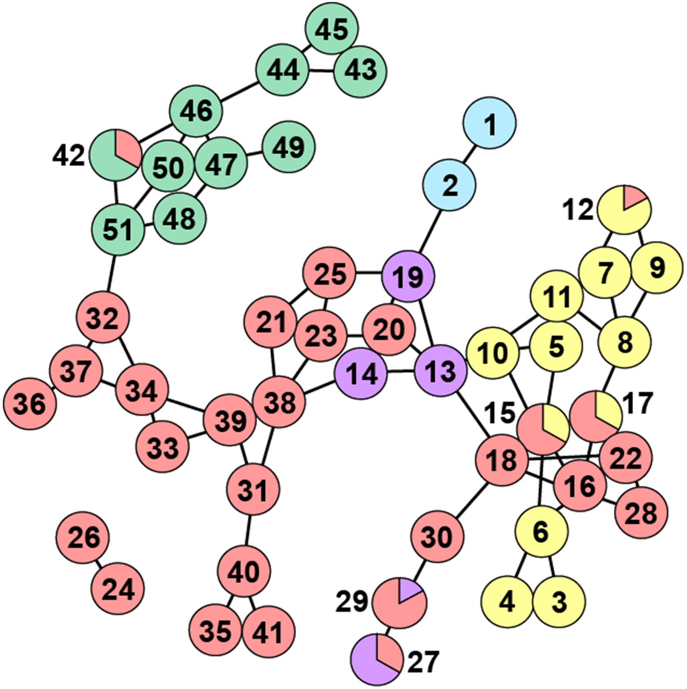

## Abstract 

As human-induced change eliminates natural habitats, it impacts genetic diversity and population connectivity for local biodiversity. The South African Cape Floristic Region (CFR) is the most diverse extratropical area for plant biodiversity, and much of its habitat is protected as a UNESCO World Heritage site. There has long been great interest in explaining the underlying factors driving this unique diversity, especially as much of the CFR is endangered by urbanization and other anthropogenic activity. Here, we use a population and landscape genetic analysis of SNP data from the CFR endemic plant Leucadendron salignum or “common sunshine conebush” as a model to address the evolutionary and environmental factors shaping the vast CFR diversity. We found that high population structure, along with relatively deeper and older genealogies, is characteristic of the southwestern CFR, whereas low population structure and more recent lineage coalescence depict the eastern CFR. Population network analyses show genetic connectivity is facilitated in areas of lower elevation and higher seasonal precipitation. These population genetic signatures corroborate CFR species-level patterns consistent with high Pleistocene biome stability and landscape heterogeneity in the southwest, but with coincident instability in the east. Finally, we also find evidence of human land-usage as a significant gene flow barrier, especially in severely threatened lowlands where genetic connectivity has been historically the highest. These results help identify areas where conservation plans can prioritize protecting high genetic diversity threatened by contemporary human activities within this unique cultural UNESCO site.