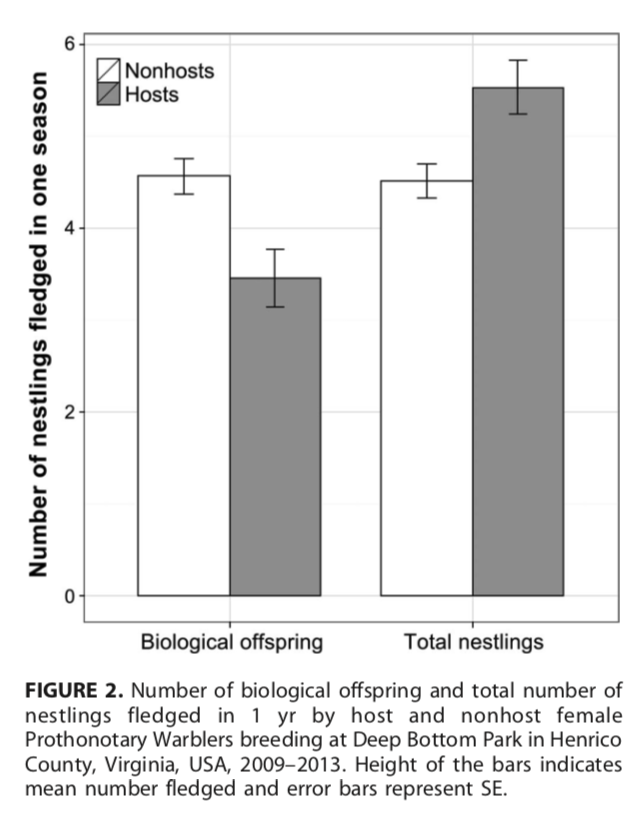

  

## Abstract

Conspecific brood parasitism (CBP), although prevalent in some avian taxa, is easily overlooked when it occurs in low frequencies, and therefore the ecology of this behavior has only occasionally been described in passerines. We describe the occurrence of CBP in a population of Prothonotary Warblers (Protonotaria citrea) breeding in nest boxes, demonstrate associated fitness costs, and investigate parasite strategy. We genotyped individuals at 6 microsatellite loci and used Cervus software to determine log-likelihood of maternity (LOD scores) for offspring and social mothers. We set critical cutoff LOD scores at 95% confidence for exclusion of the social mother and assignment of a parasite mother from the breeding population. Of 805 nestlings (233 family groups during 2009-2013), we found that 12.7% had genotypes that were incompatible with their social mother. Females with unrelated nestlings (hosts) fledged fewer biological offspring within the host year than nonhost females despite fledging more total offspring, but being a host was not significantly associated with total reproductive success over 5 yr of breeding. We were able to identify only similar to 30% of parasite females, which suggests that the majority of parasites may be floaters (i.e. non-nesters) in the population or nesting in nearby natural cavities. We found no evidence of host selection based on host age, arrival at the breeding site, or nest-box productivity in the previous year. This opportunistic behavior is likely facilitated by the nesting ecology of this population, in that nest sites are limited, conspicuous, and relatively dense. Future studies investigating CBP in populations using natural cavities can help elucidate the drivers of this behavior.
